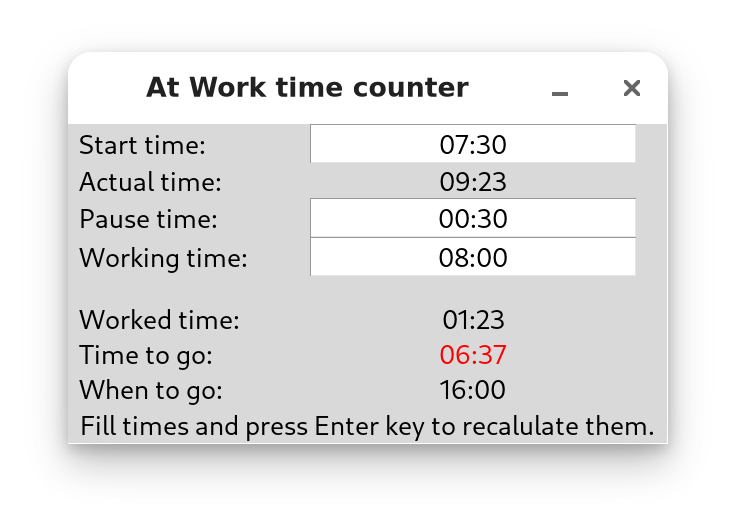

# AtWork Documentation

This directory contains the GitHub Pages documentation for the AtWork project.

## Viewing the Documentation

The documentation is available at: https://ondratu.github.io/atwork/

## Setting Up GitHub Pages

To enable GitHub Pages for this repository:

1. Go to the repository settings on GitHub
2. Navigate to "Pages" in the left sidebar
3. Under "Source", select the branch you want to use (e.g., `main`)
4. Set the folder to `/docs`
5. Click "Save"

GitHub will automatically build and deploy the site from the `docs` directory.

## Adding a Screenshot

To add an actual application screenshot:

1. Take a screenshot of the running AtWork application
2. Save it as `screenshot.png` in this `docs` directory
3. Update `index.html` to replace the placeholder div with:
   ```html
   
   ```

## Local Testing

To test the documentation locally, you can use Python's built-in HTTP server:

```bash
cd docs
python3 -m http.server 8000
```

Then open http://localhost:8000 in your web browser.
